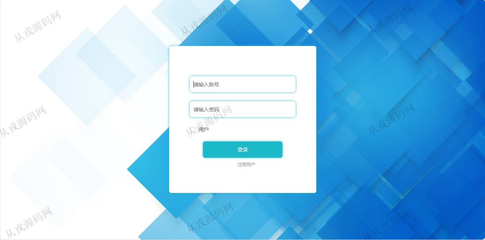

<h1 align="center">169.垃圾分类网站管理系统</h1>

 获取sql文件 QQ: 386869957 QQ群: 377586148 

 [更多源码项目: 从戎源码网](https://armycodes.com/) 

## 简介

> 本代码来源于网络,仅供学习参考使用!
>
> 提供1.远程部署/2.修改代码/3.设计文档指导/4.框架代码讲解等服务
>
> 用户端访问地址：http://localhost:8080/springboot574f8/front/index.html
> 
> 用户：user 123456
>
> 管理后台访问地址：http://localhost:8080/springboot574f8/admin/dist/index.html#/index
>
> 管理员 : admin 123456

## 项目介绍
基于springboot+vue的垃圾分类网站管理系统：前端 vue、elementui，后端 maven、springmvc、spring、mybatis；角色分为管理员、用户；集成垃圾分类、垃圾类型、垃圾图谱等功能于一体的系统。

## 功能介绍

### 用户

- 基本功能：登录，注册，退出，个人信息查看与修改，密码修改
- 网站首页：主导航栏，轮播图，全局搜素，垃圾分类展示，垃圾图谱展示
- 垃圾分类：垃圾分类信息的列表展示，搜索，分类导航，分类详情

### 管理员

- 用户管理：用户信息的增删改查，用户信息也可以由用户在前台自行注册
- 垃圾分类管理：分类信息的增删改查，分类图片上传，详情支持富文本编辑，按垃圾名称和垃圾类型搜索
- 垃圾类型管理：类型信息的增删改查
- 垃圾图谱管理：垃圾图谱信息的增删改查，按垃圾名称搜索，图片上传，详情支持富文本编辑
- 轮播图管理：轮播图信息的增删改查，轮播图对应前台轮播图设置的展示

## 环境

- <b>IntelliJ IDEA 2021.3</b>

- <b>Mysql 5.7.26</b>

- <b>Node 14.14.0</b>

- <b>JDK 1.8</b>

## 运行截图

